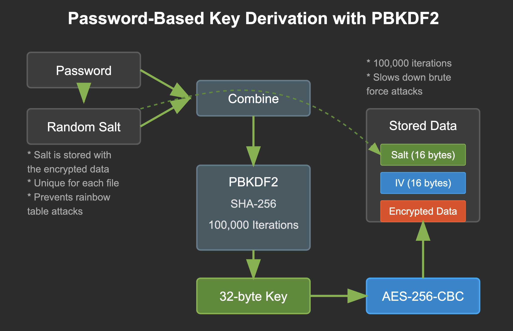

# Encrypting and Decrypting Folders

--- 
## Naive Approach to Key Generation

```python 
def __generate_key(self, pwd: str) -> tuple[bytes, bytes]:
    """Generates a key and IV from a password."""
    hashed_pwd = hashlib.sha256(pwd.encode()).digest()
    key = hashed_pwd  # Simply using hash as the key
    iv = os.urandom(16)

    return key, iv
```

**Problems:**
- No salt (vulnerable to rainbow table attacks)
- Predictable key generation

---

## Improved Key Derivation with PBKDF2

```python 
def __generate_key(self, pwd: str) -> tuple[bytes, bytes, bytes]:
    """Generates a key, IV, and salt from a password using PBKDF2."""
    salt = os.urandom(16)  # Random salt for each encryption
    kdf = PBKDF2HMAC(
        algorithm=hashes.SHA256(),
        length=32,
        salt=salt,
        iterations=100000,
    )
    key = kdf.derive(pwd.encode())
    iv = os.urandom(16)

    return key, iv, salt
```

---

## What is a Salt?

- A random value that is unique for each encryption
- Stored alongside the encrypted data (not secret)
- Ensures identical passwords still produce different encryption keys
- Makes pre-computed attacks (rainbow tables) infeasible

```python
# Writing salt with encrypted data
file.write(salt + iv + encrypted_data)

# Reading salt during decryption
salt = data[:16]
iv = data[16:32]
encrypted_data = data[32:]
```

---

## How PBKDF2 Works
<!--  -->
<figure>

</figure>


<!-- 1. Combines password with salt
2. Applies hash function repeatedly (100,000 times)
3. Computationally expensive by design
4. Makes brute force attacks much more difficult -->
