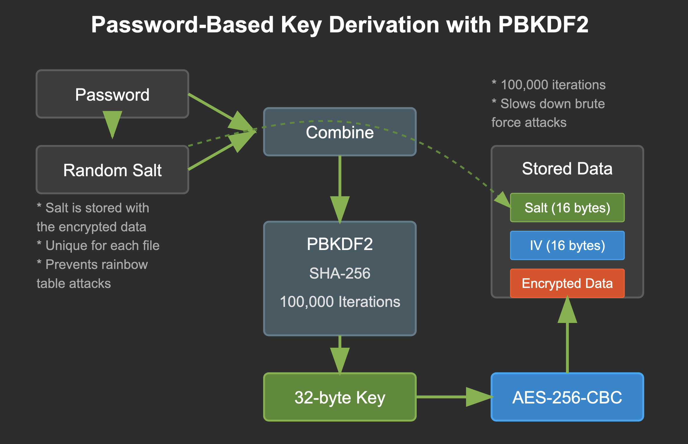

# Encrypt your data

by Fabio Plunser & Cedric Sillaber

## Run the code

### Installation
Only dependency is the `Cryptography` python package, which can be installed using `pip install cryptography`. 

We also included a `requirements.txt`, so you can install the necessary dependencies using 
```bash
pip install -r requirements.txt
```

### Usage
To use the CLI tool, simpy run the script using
```bash
python src/main.py
```
Then the cli tool will prompt you for the necessary input.

For testing purposes there is a test dir (`res/testdir`).


**Example input**:

```bash
Welcome to the CLI Manager, write 'help' to see the available commands
Encrypt(1) or Decrypt(2)?
>>1
Enter the path of the file to encrypt/decrypt
res/testdir
Do you want to keep the folder (1) or delete it (2)?
>>1
Enter the key
>>****************
```

*Note*: Run the code from the root directory, not from `src`!

## Implementation Process

We initially approached key generation using a simple SHA-256 hash:

```python
def __generate_key(self, pwd: str) -> tuple[bytes, bytes]:
    """Generates a key, IV, and salt from a password using sha."""
    hashed_pwd = hashlib.sha256(pwd.encode()).digest()
    key = os.urandom(hashed_pwd[16:])
    iv = os.urandom(16)
    
    return key, iv
```

However, this proved inadequate for security purposes, especially against rainbow table attacks. Our improved implementation uses PBKDF2:

```python
def __generate_key(self, pwd: str, salt: bytes, iv: bytes) -> tuple[bytes, bytes, bytes]:
    """Generates a key, IV, and salt from a password using PBKDF2."""
    kdf = PBKDF2HMAC(
        algorithm=hashes.SHA256(),
        length=32,
        salt=salt,
        iterations=100000,
    )
    
    key = kdf.derive(pwd.encode())
    
    return key, iv, salt
```

## Implementation Justifications

1) **AES+CBC**: We utilize AES in CBC mode for encryption as this mode is widely recognized for its security and efficiency. CBC mode ensures that identical plaintext blocks are encrypted into different ciphertext blocks, enhancing security.

2) **PBKDF2**: The key is derived from the user's password using the following scheme. Using the PBKDF2 function with the SHA-256 hashing algorithm, we derive a 32-byte key from the password. The PBKDF2 function applies 100,000 iterations to make brute-force attacks more difficult. For the iteration number we found different recommendations. Based on [this post](https://security.stackexchange.com/a/179591) 100k with salt are recommended. 

3) **Salting**: Each encryption operation uses a random 16-byte salt to prevent rainbow table attacks. The salt is stored alongside the ciphertext, ensuring that even if two identical files are encrypted with the same password, they will produce different ciphertexts. The salt does not need to be kept secret so it can be stored alongside the ciphertext.

## Encryption Process

1. User provides password and folder to encrypt
2. Folder is compressed into a ZIP file
3. Password + random salt → PBKDF2 (100,000 iterations) → Encryption key
4. AES-256-CBC encrypts the ZIP file
5. Salt, IV, and encrypted data stored in a single file
6. Original folder optionally deleted

### Visualization

The figure shows how PBKDF2 works.
<figure>



</figure>
