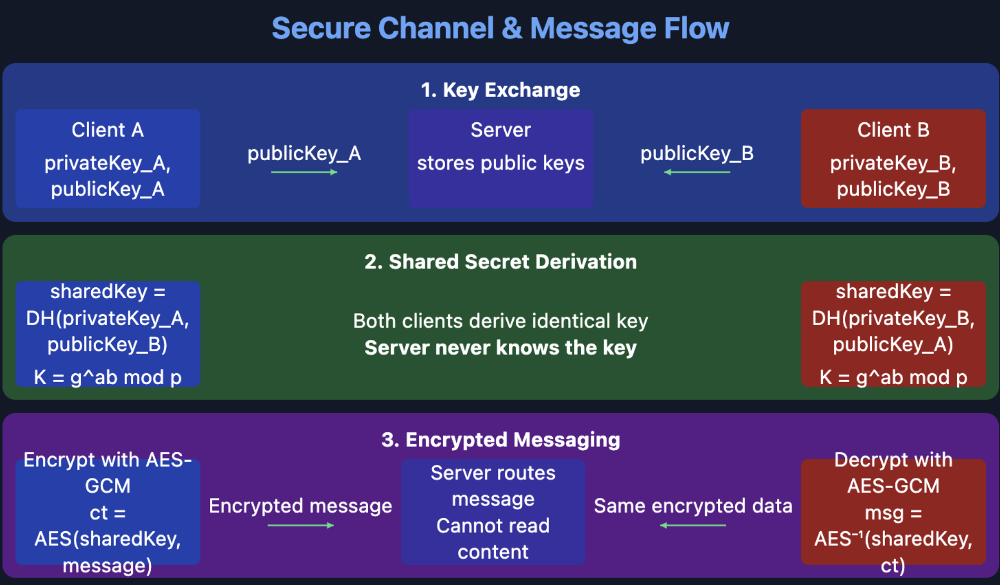

# Murmly - E2EE Messaging
by Fabio Plunser, Cedric Sillaber

---

## Our approach

- RESTful server using **FastAPI**
  - User authentication
  - Public key storage
  - Message routing only (no access to content)
- **WebSockets** for real-time messaging
- Python CLI client with `cryptography` library
- *in addition*: Full browser client (SvelteKit) with Web Crypto API


---
## Cryptography

<!-- When client is connected to server, it asks for public key of the other client -->
- Client logs in/registers, gets Diffie-Hellman parameters from server
- Creates private and public key, uploads public key to server
- Tries to establish secure connection with other client by performing key exchange
- If key exchange is successful, the client will generate a symmetric key using the shared secret
$\Rightarrow$ symmetric encryption (AES-GCM)

---
<center>
  
</center>


---
## Key Exchange: Diffie-Hellman details

```python 
# on server
def generate_dh_parameters():
    parameters: DHParameters = dh.generate_parameters(generator=2, key_size=PRIME_BITS)
    return parameters

# on client
def exchange_and_derive(priv_key: DHPrivateKey, peer_pub_key: DHPublicKey) -> bytes:
    # the peer_pub_key is B= g^{peer_private_key} mod p
    # the shared key is A=B^{priv_key} mod p
    shared_key: bytes = priv_key.exchange(peer_public_key=peer_pub_key)
    derived_key = HKDF(
        algorithm=hashes.SHA256(),
        length=32,
        salt=None,
        info=b"handshake data",
    ).derive(shared_key)
    return derived_key
``` 


---
## AES-GCM Implementation

```python
def encrypt_aes_gcm(key: bytes, data: bytes, associated_data: bytes = None) -> bytes:
    # Generate random 12-byte nonce
    nonce = os.urandom(12)
    aesgcm = AESGCM(key)
    
    # Encrypt with AES-GCM
    ct = aesgcm.encrypt(
        nonce=nonce,
        data=data,
        associated_data=associated_data,
    )
    # Return nonce + ciphertext
    return nonce + ct
```

- Provides both **confidentiality** and **authenticity**
- Each message uses a unique IV (nonce)
- Simpler solution than in last project

---
# Optional Features 
## Key Rotation Principles
- Messages are encrypted in blocks using different keys
- Key $k_1$ encrypts messages $m_i \in \{m_1, ..., m_{100}\}$
- Key $k_2$ encrypts messages $m_j \in \{m_{101}, ..., m_{200}\}$
- And so on...

---
## Forward & Backward Secrecy

**Forward Secrecy:**
- If attacker compromises key $k_2$, they cannot derive $k_1$
- Past messages remain secure

**Backward Secrecy:**
- If attacker compromises key $k_1$, they cannot derive $k_2$
- Future messages remain secure

---
### ❌ Incorrect Implementation

```python
def derive_next_key(current_key: bytes, salt: bytes = None) -> bytes:
    if salt is None:
        salt = os.urandom(32)  # Random salt!

    derived_key = HKDF(
        algorithm=hashes.SHA256(),
        length=32,
        salt=salt,
        info=b"forward_secrecy_rotation",
    ).derive(current_key)

    return derived_key, salt
```

Problem: Random salt requires communication between parties!

---
### ✅ Correct Implementation

```python
def derive_key_for_rotation(self, rotation_number: int) -> bytes:
    if rotation_number == 0:
        return self.initial_key

    # Deterministic salt from rotation number
    salt = rotation_number.to_bytes(32, byteorder='big')
    
    # Get previous rotation's key
    prev_key = self.get_key_for_rotation(rotation_number - 1)
    
    # One-way key derivation
    derived_key = HKDF(
        algorithm=hashes.SHA256(),
        length=32,
        salt=salt,
        info=b"chat_key_rotation",
    ).derive(prev_key)
    
    return derived_key
```

---
- Deterministic salt = no communication needed
- One-way function prevents deriving previous keys
- Rotation number prevents deriving future keys


---
## Additional: Full browser client

- Implemented a web browser client using SvelteKit (JavaScript framework)
- Implements its own cryptography implementation, similar to the Python implementation


---
## Additional: Web Client Cryptography
```typescript
export async function deriveSharedSecret(
  privKey: DHPrivateKey,
  peerPubKey: DHPublicKey
): Promise<CryptoKey> {
  // Shared secret: (peer_pub_key.y ^ my_priv_key.x) mod p
  const sharedSecretBigInt = power(peerPubKey.y, privKey.x, privKey.params.p);

  const sharedSecretKey = await window.crypto.subtle.importKey(
    ...
    sharedSecretBytes.buffer,
  );
  
  // Derive key using HKDF (same as Python implementation)
  return window.crypto.subtle.deriveKey(
    {
      name: "HKDF",
      salt: new Uint8Array(0),
      info: new TextEncoder().encode("handshake data"),
      hash: "SHA-256",
    },
    sharedSecretKey,
    { name: "AES-GCM", length: 256 },
    false, ["encrypt", "decrypt"]
  );
}
```


---
## What didn't work
- Chat history decryption


---
## Lessons learned
- Python implementation with simple CLI tool was relatively easy to implement
- Browser client was more challenging due to JavaScript being Javascript
  - Used most of our development time
  - Affected our final submission a bit

---
## Demo

Let's see it in action!